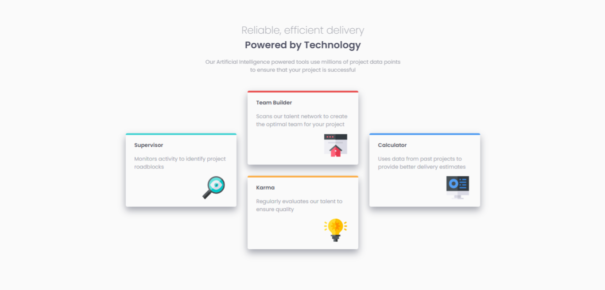
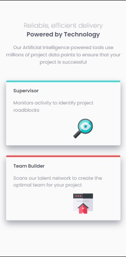

# Frontend Mentor - Four card feature section solution

This is a solution to the [Four card feature section challenge on Frontend Mentor](https://www.frontendmentor.io/challenges/four-card-feature-section-weK1eFYK). 

## Table of contents

- [Overview](#overview)
  - [The challenge](#the-challenge)
  - [Screenshot](#screenshot)
  - [Links](#links)
- [My process](#my-process)
  - [Built with](#built-with)
  - [Useful resources](#useful-resources)
- [Author](#author)

**Note: Delete this note and update the table of contents based on what sections you keep.**

## Overview

### The challenge

Users should be able to:

- View the optimal layout for the site depending on their device's screen size

### Screenshot

### Links

- Solution URL: [Add solution URL here](https://your-solution-url.com)
- Live Site URL: [Add live site URL here](https://your-live-site-url.com)

## My process

### Built with

- Semantic HTML5 markup
- CSS custom properties
- CSS Grid
- Mobile-first workflow
- [Animate on Scroll](https://github.com/michalsnik/aos) - AOS library

### Useful resources

- [AOS library documentation](https://michalsnik.github.io/aos/) - Provides a detailed use on the AOS Library,also a link to AOS library documentation

## Author

- Frontend Mentor - [@yourusername](https://www.frontendmentor.io/profile/micahCodes)
- Twitter - [@micahCodes](https://www.twitter.com/_micahcodes)